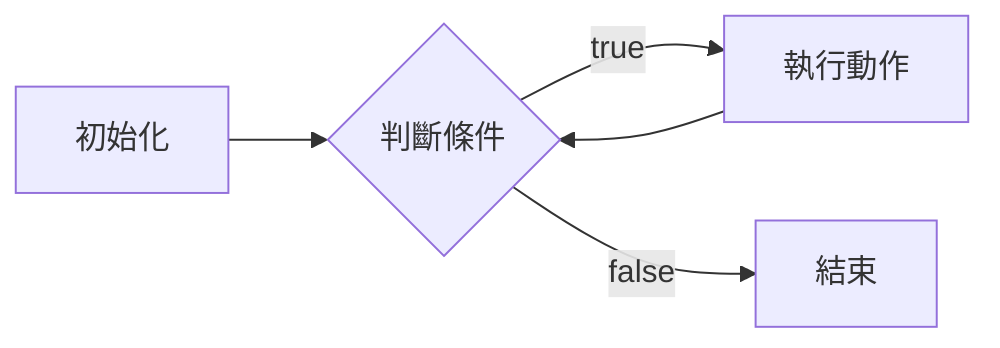
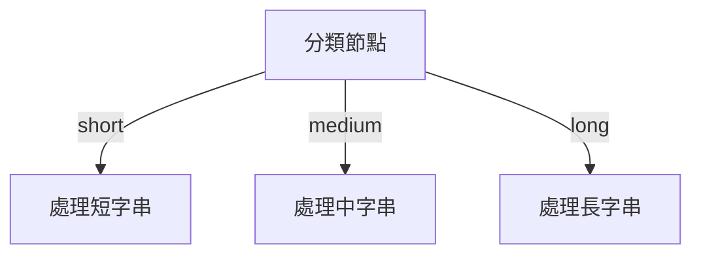

# Workflow POC 詳細導引手冊

本手冊旨在幫助初學者理解如何使用「組合式邏輯」建構強大的自動化工作流。

## 1. 核心哲學：信號與邊界 (Signal & Boundary)

想像你在導航：
- **節點 (Nodes)** 是地圖上的「地點」（執行動作）。
- **邊 (Edges)** 是地點間的「道路」（傳輸數據）。
- **信號 (Signals)** 是節點執行完後發出的「方向燈」。

與傳統編程不同，這裡的邏輯**不在節點內**，而在**邊界(邊)**上。節點只負責執行動作並告訴大家它執行得如何（發射信號），由邊來決定接下來該去哪裡。

## 2. 元件解說

### 🧩 節點類型 (WorkflowNode)
1. **CONVERT (轉換)**: 
   - 作用：把 A 變成 B（例如：字串轉大寫）。
   - 信號：恆為 `success`。
2. **IF (判斷)**:
   - 作用：檢查條件是否成立。
   - 信號：成立發送 `true`，不成立發送 `false`。
3. **CUSTOM (自定義/Switch)**:
   - 作用：複雜邏輯處理。
   - 信號：可自定義，例如 `odd`/`even`、`mod0`/`mod1`。
4. **SUB_WORKFLOW (子流程)**:
   - 作用：封裝一段邏輯，像一個黑盒節點一樣被複用。

### 🛤️ 邊界 (WorkflowEdge)
- 決定「路徑」：只有當信號匹配時才允許通行。

## 3. 組合範例 (視覺化)

### 🔄 迴圈模式 (Loop Pattern)
透過將邊指回先前的節點，你可以組出任何循環。

### 🔀 分支模式 (Branching Pattern)
一個節點可以根據信號發散到多個方向。

## 4. 如何開始使用？

1. **定義狀態 (State)**: 最好用 Java `record` 來定義循環中需要保持的數據。
2. **建立節點**: 使用 `WorkflowNode.create...` 系列方法。
3. **連結邊界**: 使用 `workflow.addEdge(...)` 並指定正確的信號。
4. **啟動引擎**: 使用 `new FlowEngine<>(workflow).execute(input)`。

> [!TIP]
> **高度自由的動態組合**之所以強大，是因為你可以在 Runtime 動態改變這些邊與節點的連線方式，而不需要修改 Java 原始碼。
